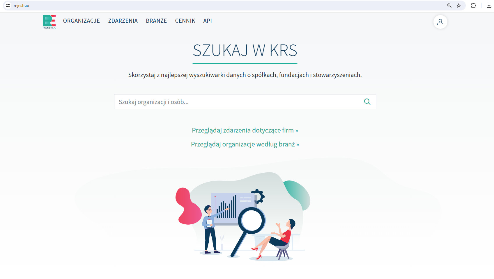
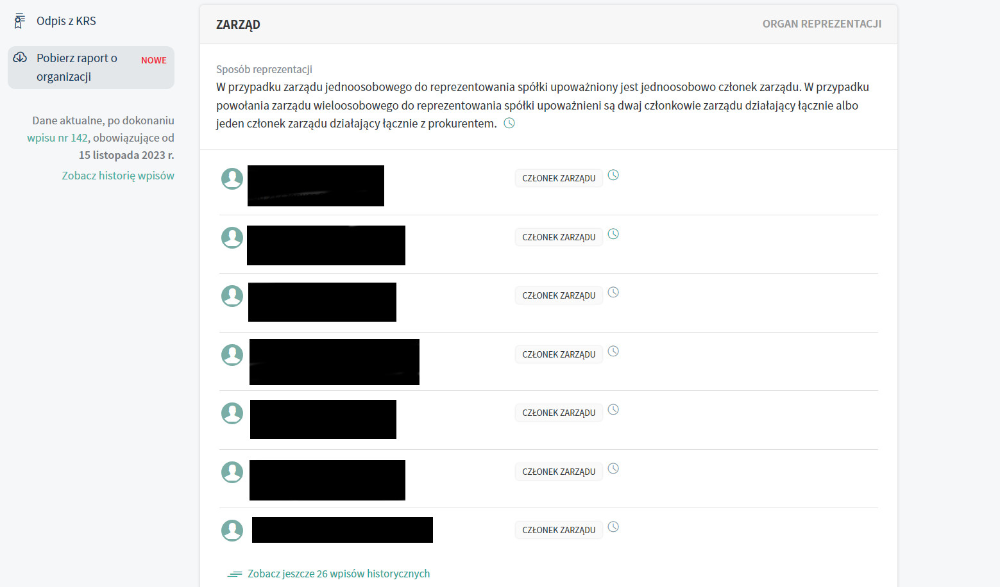

# KRS Web Scraper
This project is a part of bigger project called **Analysis of data from the National Court Register** implemented by a team of 3 students as a part of the Data Mining course at the AGH UST in 2023/2024.
Every team member had tasks to do. I was responsible for KRS data collection through the use of my programmed web scraper in Selenium.

## Analysis of data from the National Court Register

## How does it work
1. Web scraper opens Rejestr.io | Wyszukiwarka danych z KRS website.
2. Because the complete list of valid KRS numbers is unknown to me, web scraper checks every single number from given interval by pasting it into the search bar on the website.

3. Web scraper omits unused KRS numbers or KRS numbers of companies that no longer exist (removed website of a company). When program encounters website of existing company it scrapes company name and full names
   of board memebers.

## How to use web scraper

## Future work

## Data Source
- Rejestr.io | Wyszukiwarka danych z KRS https://rejestr.io/krs/

## Technology stack
- Python

- Selenium
